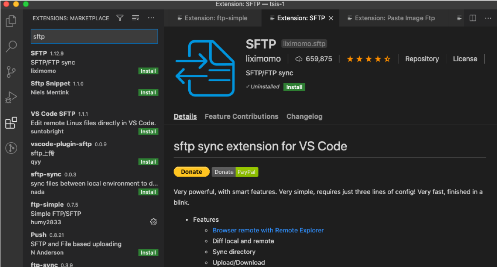

# Visual Studio Code를 사용한 HTML/CSS 개발

## 목차

1. Visual Studio Code 설치 및 환경 세팅
   - Visual Studio Code 설치
   - Live Server 플러그인 설치
   - FTP 업데이트 환경 설정
   - Git 연동
2. 코드표준화
   - prettier now (코드포맷)
   - MDN 레퍼런스 보기
3. 편리한 기능
   - Emmet(코드 자동 완성)
   - Intellisense for CSS name(코드 자동완성)
   - auto rename(코드 자동 완성)
   - CSS Peek(코드 네비게이션)

## 1\. Visual Studio Code 설치 및 환경 세팅

### **Visual Studio Code 설치**

https://code.visualstudio.com 에서 사용자 OS에 맞는 버전 다운로드하여 설치


### **Live Server 플러그인 설치**

- Live Server 는 서버 연동없이 작업중인 HTML/CSS 화면을 실시간으로 브라우저에 반영하여 보여주는 플러그인
- 화면 레이아웃을 확인하며 작업하기에 편리함  


1. Vscode 실행하여 extension메뉴에서 live server 검색

2. Install 버튼 클릭하여 플러그인 설치 > 재시작


3. 하단 상태바에 "Go Live" 버튼 클릭

4. 브라우저에서 실시간으로 레이아웃 변경 확인 가능

### **FTP 업데이트 환경 설정(SFTP)**

- 별도의 FTP 프로그램 없이 Visual Studio 내에서 파일 저장과 동시에 FTP 업데이트 되는 플러그인 설치 및 연결



1. extension메뉴에서 sftp검색

2. Install 버튼 클릭하여 플러그인 설치


3. 새로운 폴더 혹은 기존 프로젝트 폴더를 열어준 후 "F1"을 눌러 "sftp" 검색 후 "sftp:config"을 선택


4. ".vscode" 폴더와 "sftp.json" 파일이 생성되면 서버 접속정보를 입력하고 저장


5. 하단 상태바에서 sftp 누르면 상태확인 가능

### **Git 업데이트 환경 설정**
작성중
<br/>

## 2\. 코드 표준화


### **prettier now(코드포맷)**

파일 저장 시 코드를 미리 정해진 규칙에 따라 정리함.


1. Extension에서 prettier 검색하여 설치  


2. setting.json파일을 열어 위 내용대로 설정
   

### **MDN 레퍼런스 확인**
html태그에 커서를 올리면 해당 태그에 대한 정의와 mdn 레퍼런스 링크가 나오는데 해당 링크 클릭하면 mdn 웹사이트로 이동
html 표준 및 적확한 태그 사용을 위해 유용한 기능 


## 3\. 편리한 기능 
### **Emmet (코드 자동 완성)**   
-  vs code 기본 기능으로, HTML + CSS 코드를 짧은 축약어로 자동완성
-  태그명(축약어)를 입력 후 tab 입력

  

```
참고
유효한 약어 는 Emmet 치트 시트 의 HTML, CSS 섹션을 참조
(https://docs.emmet.io/cheat-sheet/)
```

### ** Intellisense for CSS name **

- 연결된 CSS파일에 정의된 class명을 자동 완성
- 지원 언어 : HTML/PHP/JavaScript/JavaScript/React/Vue 등
- Extension 에서 Intellisense for CSS name 검색하여 설치


### **auto rename(코드 자동 완성)**

- HTML 태그 수정 시 여는 태그를 수정하면 닫는 태그 자동으로 수정
- Extension 에서 auto rename검색하여 설치


### **CSS Peek(코드 네비게이션)**

- HTML에 사용된 class나 ID 클릭하여 해당 CSS코드로 이동
- 커서 이동하여 ctrl + click
- Extension 에서 CSS Peek 검색하여 설치


